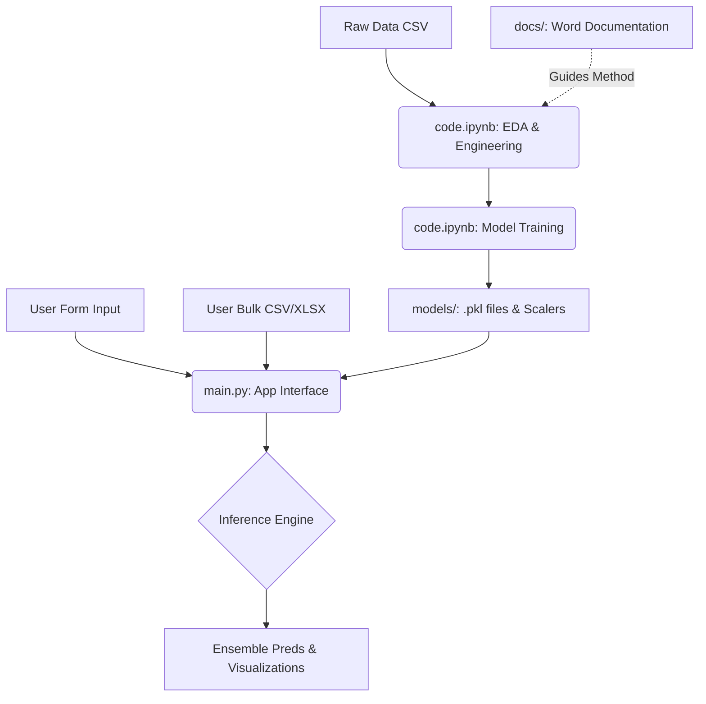

# 📊 End-to-End Code Flow: Telecom Customer Churn Prediction

This document breaks down the end-to-end flow of the machine learning pipeline and the interactive application.

## 1. Documentation & High-Level Architecture (`docs/`)
The `docs/` folder contains the primary theoretical documentation (`TELECOM CUSTOMER CHURN PREDICTION USING MACHINE LEARNING.docx`).
*   **Purpose:** Houses the initial project specifications, methodology, data dictionary, and business objectives.
*   **Flow:** This document serves as the foundation for the project requirements that drive the EDA and feature engineering approaches taken in the codebase.

## 2. Model Training Pipeline (`code.ipynb`)
The Jupyter Notebook serves as the core ML laboratory where data is prepared and models are built. 

*   **Step 1: Data Ingestion:** 
    *   Loads raw data from `telecom_customer_churn.csv`.
*   **Step 2: Exploratory Data Analysis (EDA) & Cleaning:**
    *   Identifies missing values, performs data imputation, and visualizes statistical distributions.
*   **Step 3: Feature Engineering:**
    *   Creates derived features that add predictive value, such as `TotalServices` (a sum of binary service usage like Streaming TV, Online Backup, etc.).
*   **Step 4: Data Preprocessing:**
    *   **Scaling:** Applies `StandardScaler` to continuous numerical features (e.g., Monthly Charge, Total Charges).
    *   **Encoding:** Utilizes Dummy Variables/Label Encoders for categorical string variables (e.g., Gender, Married, Internet Service).
*   **Step 5: Model Training & Evaluation:**
    *   Trains multiple state-of-the-art algorithms: **Random Forest, XGBoost, Gradient Boosting, and Logistic Regression**.
    *   Generates a comparative performance matrix (Accuracy, Precision, Recall, F1, ROC-AUC).
*   **Step 6: Artifact Export:**
    *   Persists trained model checkpoints (`*_model.pkl`), `scaler.pkl`, variable encoders, and a `model_performance.csv` statistics sheet into the `models/` directory.

## 3. Interactive Web Application (`main.py`)
The Streamlit application consumes the pre-trained artifacts from the pipeline and exposes them to the user.

*   **Initialization (`load_models()`):** 
    *   Loads the serialized models, scalers, and label encoders into an active memory cache upon startup.
*   **Module A: Single Prediction (`🎯 Single Prediction`):**
    *   *Input:* User fills out a multi-column form partitioned by "Demographics", "Service Information", and "Financial Information".
    *   *Processing:* `prepare_input_data()` takes these inputs, structures them identically to the original training dataset (calculating `TotalServices` on the fly), and applies the exact same loaded `scaler`.
    *   *Prediction:* `make_predictions()` feeds the scaled vector individually into all 4 loaded models.
    *   *Output:* Displays a Gauge Chart per model and averages them to output a final "Ensemble Probability" with actionable insights (High Risk vs Low Risk).
*   **Module B: Bulk Prediction (`📊 Bulk Prediction`):**
    *   *Input:* User uploads a `.csv` or `.xlsx` file mapping to a strict template of required columns.
    *   *Processing:* Automatically loops through columns to impute missing categorical and numerical fields, encodes categorical mapping to `int`, and ensures the feature matrix matches the expected length/structure.
    *   *Output:* Augments the uploaded Dataframe with a `{ModelName}_Probability` for each model alongside a final `Risk_Level` classification, before rendering a pie chart distribution and letting the user export the predictions file.
*   **Module C: Model Insights (`📈 Model & Data Insights`):**
    *   Displays the `model_performance.csv` statistics as a styled dataframe metrics table.
    *   Generates interactive Plotly graphs to highlight algorithmic KPIs of the models.
    *   Automatically extracts metadata to highlight the *Best Performing Model* (based on highest ROC-AUC) .

## 4. Summary of Data Flow

